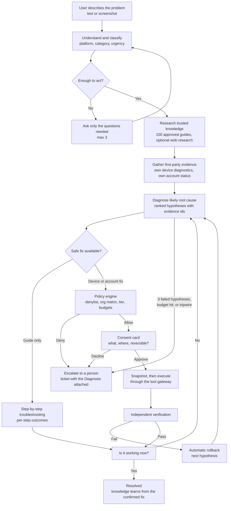

# HelpDesk First — product overview

An IT help desk where AI handles Level-1 and people handle the exceptions.
Users describe a problem in plain English; the assistant checks trusted guides
and, if allowed, the user's own device and account, proposes a safe fix, runs it
only with consent, and confirms it actually worked. When it cannot fix something
safely, the IT team gets a ready-made Diagnosis instead of a vague ticket.

The AI never has authority on its own. Every change passes deterministic
policy, user consent, verification, automatic rollback, and an immutable audit
log. The model proposes; code decides.

## How it works

A failed check triggers automatic rollback and the next hypothesis. After three
failed hypotheses, any exhausted budget, or anything unsafe, a person takes over
with everything already tried. "Talk to a human" is visible in every state and
escalates in one tap.

## Who it is for

| Who                              | Typical issues it handles                                                             | What matters most                                                                                |
| -------------------------------- | ------------------------------------------------------------------------------------- | ------------------------------------------------------------------------------------------------ |
| Schools and colleges             | Wi-Fi/eduroam, printing, LMS and email login, lab PCs, September and exam-week spikes | Domain auto-join and SSO; student BYOD stays read-only; FERPA, plus COPPA for K-12               |
| Law firms                        | Outlook sync, VPN to document systems, scanners, Teams audio, disk full               | Invitation-only access, per-org encryption, full audit of who approved what                      |
| Small dental and medical offices | Printer offline, scanner missing, slow internet, stuck updates                        | Office manager runs it; not for patient data until vendor BAAs are in place                      |
| Small businesses (5–100 people)  | Wi-Fi, VPN, email, printing, call audio, own-account password reset                   | No IT hire needed; the owner sees the verified resolution rate                                   |
| Individuals                      | Guided fixes across 100 guides in 12 categories                                       | Free guides without an account; sign-in adds bookmarks, progress, tickets; AI fixes need sign-in |

### Single user

- Homepage assistant: describe the problem, get routed to the right guide after
  at most three clarifying questions. Platform (Windows, macOS, iOS, Android) is
  detected or asked once.
- 100 step-by-step guides in 12 categories with per-step "Did this work?"
  outcomes, typo-tolerant search, browse by category, a browser network check,
  offline/installable PWA, dark mode, mobile layout.
- With an account: bookmarks, saved progress, ratings, and a ticket portal
  (create from a failed guide with the steps already tried attached, track,
  reply, attach scanned screenshots, confirm the fix, reopen, rate).
- With the requester agent enabled for the org: live step timeline, evidence
  citations, consent cards for fixes on the user's own enrolled device,
  screenshot input, and a persistent "You are talking to an AI assistant"
  label.

### Organizations

- Membership by invitation link, verified email domain (`@school.edu`
  auto-joins as requester), or SSO (Google Workspace, Microsoft Entra ID).
  Roles: `requester`, `support_agent`, `org_admin`.
- Staff tools: live ticket queue with SLA targets, assignment and status edits,
  requester replies, a Diagnosis card on every escalated ticket, the AI
  Resolution Center (runs, policy decisions, actions, verification, rollback,
  metrics, shadow review, kill switches), device inventory with per-capability
  autonomy tier, knowledge review drafts, privacy-safe analytics, export API,
  status page.
- Admin controls: feature flags per org, the capability matrix and autonomy
  tiers, daily caps, kill switches, identity connectors.

## Safety

Autonomy is earned one fix at a time, and some things are never automated.

- **Own device, own account only.** Targets are resolved from the signed-in
  session and identity binding; the model never supplies a user, device, or
  org id. "Do it for my coworker" halts the session and alerts security.
- **Consent for every change.** A card shows what will happen, on which device
  or account, and whether it can be undone. Consent tokens are single-use and
  bound to session, capability, parameters, target, and a 5-minute expiry.
- **Earned autonomy.** Tiers run `disabled → shadow → consent → autorun`. A
  fix runs without a tap only after 50+ approved runs at 95%+ verified
  success, zero rollback failures, zero security incidents, a snapshot-based
  rollback, and an explicit org_admin sign-off. Failures demote it
  automatically; promotion is never automatic.
- **Research never acts.** Web results and guide text can inform a diagnosis
  but never authorize a change; every proposal must cite first-party evidence.
- **Verified means verified.** The agent may not say "fixed" until an
  independent verifier passed and the user confirmed.
- **Hard limits.** Global, org, capability, and provider kill switches checked
  before every step; per-session budgets (5 actions, 25 tool calls, 15 model
  turns); daily caps per user and per org with auto-pause; rate limits on
  every AI endpoint; all tool output, guide text, and screenshot
  transcriptions wrapped as untrusted data.

Never automated, in any organization, at any tier: account unlock, MFA and
recovery-method changes, privilege or group or role changes, disabling or
weakening security tools, deleting data outside the temp-cleanup scope,
installing unapproved software, and anything without a registered rollback.
These go to a person with the Diagnosis attached. The list is a hard-coded
constant checked before any org configuration.

## Your data

Each organization's data is isolated by row-level security, with optional
per-organization envelope encryption of ticket text, evidence, diagnoses, and
attachment scan details. Attachments are quarantined and scanned before anyone
views them and expire on a retention schedule (30 days for agent screenshots).
Secrets, tokens, serials, and other PII are redacted before anything reaches a
model; raw prompts and completions are never logged.

| Vendor           | Role                           | What it receives                                                                  |
| ---------------- | ------------------------------ | --------------------------------------------------------------------------------- |
| Supabase         | Database, sign-in, storage     | All application data, isolated per organization                                   |
| Vercel           | Hosting                        | Web requests                                                                      |
| Anthropic        | AI model                       | Chat text and redacted diagnostics; screenshots for transcription (no tools)      |
| Brevo            | Email                          | Recipient address and ticket notifications                                        |
| Upstash          | Rate limiting                  | Request counters                                                                  |
| Sentry           | Error tracking                 | Error reports                                                                     |
| Tavily or Brave  | Web research (off by default)  | Search queries only; never screenshots, device data, or ticket text               |
| Cloudflare       | Turnstile captcha (optional)   | Form challenge tokens                                                             |
| VirusTotal       | Attachment scanning (optional) | File hashes and uploaded attachments for scanning                                 |
| Microsoft/Google | Identity connectors (optional) | Read-only lookups of the signed-in user's own account; self-service reset actions |

Compliance note: HelpDesk First is not approved for protected health
information. Healthcare use requires signed BAAs with each applicable vendor
above first, and per-org encryption should be enabled.

## Status and getting started

Guides, tickets, and staff tools are live today. AI actions are built, tested
behind release gates, and off until an organization turns them on.

| Capability                                                | Status                        |
| --------------------------------------------------------- | ----------------------------- |
| Guides, assistant, tickets, staff queue, SLA, analytics   | Live                          |
| Organizations, roles, domain join, invitations, SSO       | Live                          |
| Secure attachments (quarantine, scan, retention)          | Built, off by default         |
| Read-only requester agent, consent fixes, autonomy ladder | Built, off by default         |
| Screenshot input (model transcription as untrusted text)  | Built, off by default         |
| Device agent (Windows, macOS, Linux)                      | Built, shadow mode by default |
| Account fixes via Microsoft Entra ID or Google Workspace  | Built, off by default         |
| Web research layer, per-org encryption                    | Built, off by default         |

Rollout for a new organization (details in [`PILOT-RUNBOOK.md`](PILOT-RUNBOOK.md)):

1. Create the org, add your email domain or invites, and connect SSO. Staff use
   the queue; users get guides and tickets. No AI actions yet.
2. Turn on the read-only agent for the org. It diagnoses and recommends;
   nothing runs. Watch the Resolution Center.
3. Install the device agent on a pilot group and allow two or three reversible
   fixes with consent.
4. Promote the safest fixes to run automatically once they meet the ladder
   criteria. Users still grant a one-time session consent.

## Read more

- [`AUTONOMOUS-RESOLUTION.md`](AUTONOMOUS-RESOLUTION.md) — architecture, boundaries, threat model
- [`GUARDRAILS.md`](GUARDRAILS.md), [`SECURITY-REVIEW.md`](SECURITY-REVIEW.md) — enforced controls
- [`PILOT-RUNBOOK.md`](PILOT-RUNBOOK.md), [`PILOT.md`](PILOT.md) — turning it on for an org
- [`DEVICE-AGENT.md`](DEVICE-AGENT.md) — installing the local agent
- [`REQUESTER-AGENT-C2.md`](REQUESTER-AGENT-C2.md), [`REQUESTER-AGENT-C3.md`](REQUESTER-AGENT-C3.md), [`REQUESTER-AGENT-C4.md`](REQUESTER-AGENT-C4.md) — consent actions, autonomy ladder, screenshots
- [`DATA-PROTECTION.md`](DATA-PROTECTION.md), [`RESEARCH-LAYER.md`](RESEARCH-LAYER.md)
- [`PRODUCTION-ROADMAP-STATUS.md`](PRODUCTION-ROADMAP-STATUS.md) — done vs. open
